# 序章一：Git 与 GitHub——代码管理与协作入门

> 本章目标：第一次接触 Git 与 GitHub 的学习者，在完成本章后，能够下载项目、记录自己的修改、把项目上传到 GitHub，并完成一次最基本的协作。

## 0. 从创建第一个文件开始

本章以 Windows 和 VS Code 为例。遇到菜单名称略有不同时，按功能寻找即可。先花几分钟认识文件和路径，后面的 Git 命令就容易理解多了。

### 0.1 文件、文件夹与扩展名

**文件**保存具体内容，例如一张照片、一篇文章或一段代码；**文件夹**用来收纳文件和其他文件夹，也叫“目录”。桌面上的快捷方式通常只是入口，不是文件本身。

文件名末尾的 `.txt`、`.html`、`.md` 叫作**扩展名**，帮助软件判断如何打开文件：

| 扩展名 | 本章用途 | 通常用什么打开 |
| --- | --- | --- |
| `.txt` | 存放供复制的纯文本源代码 | VS Code 或记事本 |
| `.html` | 网页入口文件 | VS Code 编辑，浏览器展示 |
| `.md` | Markdown 教程与项目说明 | VS Code 编辑和预览 |

同一个 HTML 文件既可以在编辑器中显示代码，也可以在浏览器中显示网页。改变打开软件不会改变文件内容。扩展名也不是文件转换器：把照片改名为 `.html` 并不能变成网页。本实验的 TXT 本来就存放完整 HTML 文本，所以可以复制到 HTML 文件中。

先按 `Win+E` 打开 Windows 文件资源管理器，开启扩展名显示：Windows 11 通常在“查看 → 显示 → 文件扩展名”；Windows 10 通常在“查看”选项卡勾选“文件扩展名”。这样能看文件的扩展名，也方便我们后面对扩展名进行修改。

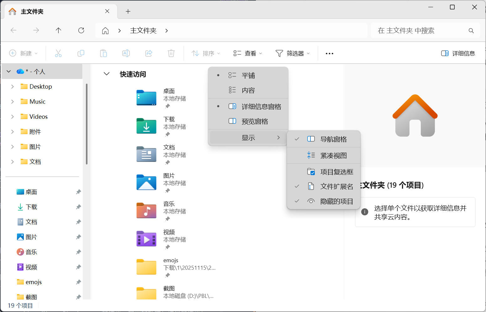

### 0.2 创建自己的练习目录

1. 在“文档”或你熟悉的位置，新建一个名为 `code-practice` 的文件夹。可以右键空白处选择“新建 → 文件夹”，也可以按 `Ctrl+Shift+N`。
2. 打开它，再创建 `my-first-page` 文件夹。这就是你的独立网页项目。
3. 单击资源管理器的地址栏，查看它所在的位置。类似 `F:\code-project\my-first-page` 的文字叫**路径**，它说明文件夹在哪里。你的实际路径可能不同，不要照抄这个示例。

> 注意：选择创建新文件时，文件的路径尽量不要出现中文，大概率会因为编码转换问题导致出现路径乱码，乱码就会导致系统和程序在运行过程中出现错误，可能引发很多不必要的麻烦，即使用拼音也尽量不要使用中文路径来进行开发，即使是用`F:\wo_de_xiang_mu\`也尽量不要用`F:\我的项目\`，“锟斤拷”就是一类常见的编码转换问题导致的乱码。

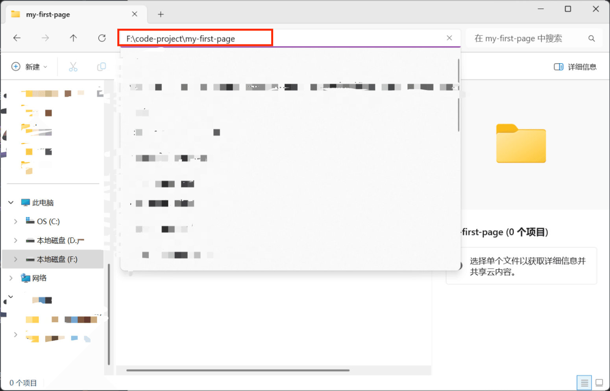

“下载的教程目录”是学习材料，“自己创建的项目目录”是作业位置。以后只把自己的 `my-first-page` 上传到实验仓库，避免把整套教程一起提交。

### 0.3 安装 VS Code，打开整个文件夹

还没有 VS Code 时，从 [VS Code 官网](https://code.visualstudio.com/) 下载 Windows 安装程序，运行后按提示安装。浏览器的“下载”列表可以找到刚保存的安装程序；安装完成后，从开始菜单启动 VS Code，不必每次重新运行安装包。

> 关于vscode的配置：如若没有安装配置完成推荐观看[vscode使用教程【2026最新】vscode安装教程vscode配置c/c++教程vscode怎么设置中文-哔哩哔哩](https://b23.tv/a9rbE4M) 或者[【最新教程】5分钟搞定VScode中配置Python运行环境-哔哩哔哩](https://b23.tv/Gi4Z4zL) 并完成vscode的基础配置后，再继续往下进行，这两个是我个人觉得讲的比较清楚的视频教程。更推荐优先配置python环境，因为此教程主要是基于python。

在 VS Code 中选择“文件（File）→ 打开文件夹（Open Folder）”，选中刚创建的 `my-first-page`，点击“选择文件夹”。左侧资源管理器最上方应显示这个文件夹名。如果出现工作区信任提示，先确认是自己刚创建的项目；陌生来源的项目应先了解内容。

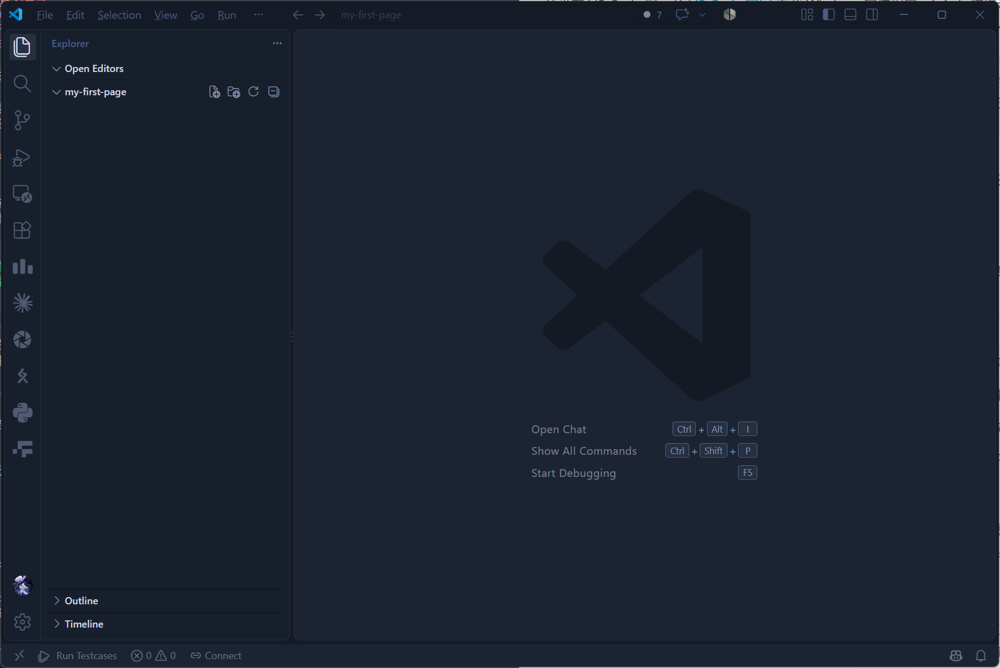

点击左侧“新建文件”按钮，输入 `practice.txt`，按回车。在右侧编辑区输入“这是我保存的第一个练习文件”，按 `Ctrl+S` 保存。

| 操作 | 快捷键 | 注意事项 |
| --- | --- | --- |
| 保存 | `Ctrl+S` | 确保编辑区里的修改写入文件 |
| 全选、复制、粘贴 | `Ctrl+A`、`Ctrl+C`、`Ctrl+V` | 先点击需要操作的编辑区 |
| 撤销 | `Ctrl+Z` | 误删或误改时先尝试撤销 |
| 查找 | `Ctrl+F` | 在当前文件中定位文字 |
| 重命名 | 选中文件后 `F2` | 检查扩展名是否正确 |

关闭 `practice.txt` 标签，再从左侧打开，确认刚才的文字还在。关闭标签只是不再显示文件，不会删除它。练习结束后可右键删除这个测试文件；保留自己后面真正要用的网页文件。

> 删除文件也可直接使用`Shift+Del`或者`Del`，`Shift+Del`与`Del`的区别是，`Del`是将文件移入回收站，与上面右键删除文件效果一致，可恢复，`Shift+Del`是直接永久删除，不进回收站，常规手段无法恢复，所以除非确认某文件无用，否则请谨慎使用

### 0.4 认识终端与当前位置

选择“终端（Terminal）→ 新建终端（New Terminal）”，下方会出现命令输入区。本章命令按 VS Code 的 PowerShell 终端说明：每次输入一行，按回车执行，等提示符重新出现后再输入下一行。

可以把下面两行命令分别复制到终端执行，观察终端输出：

```powershell
pwd
dir
```

`pwd` 显示终端当前所在目录；`dir` 列出这个目录中的文件。接下来大多数 Git 命令都应在自己的项目目录里执行。

`cd` 用于切换目录。输入 `cd`、空格和你的实际完整路径；路径放在英文双引号中，可以正确处理包含空格的文件夹名。`cd ..` 表示回到上一层。你也可以重新在 VS Code 打开正确项目，并新建终端。

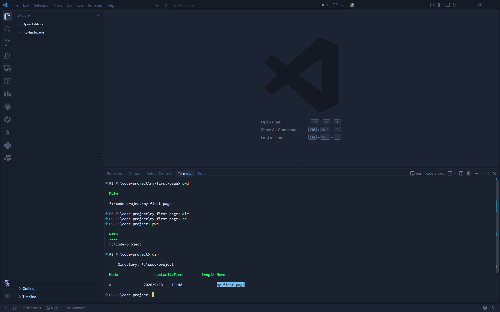

**相对路径**是从当前位置出发寻找文件，例如在项目目录中 `index.html` 就表示当前目录里的网页；**绝对路径**给出从盘符开始的完整位置。报“找不到文件”时，先检查当前位置和文件名，不要立即重复安装软件。

## 1. 先理解 Git 和 GitHub

Git 是安装在电脑上的版本管理工具。它会记录文件发生过哪些变化，方便我们查看历史、恢复版本和多人协作。GitHub 是保存 Git 仓库的网站，可以把它理解为“项目的远程存放与协作平台”。

二者不是同一个东西：没有 GitHub 也能在本地使用 Git；没有安装 Git，也能浏览 GitHub 网页，但很难完成正式的项目开发流程。

## 2. 注册 GitHub 账号

1. 打开 [GitHub](https://github.com/)。
2. 单击注册按钮，填写邮箱、密码和用户名。
3. 完成人机验证与邮箱验证。
4. 登录后进入个人主页。

用户名会出现在个人主页和仓库地址中，建议使用容易辨认、长期可用的英文名称。

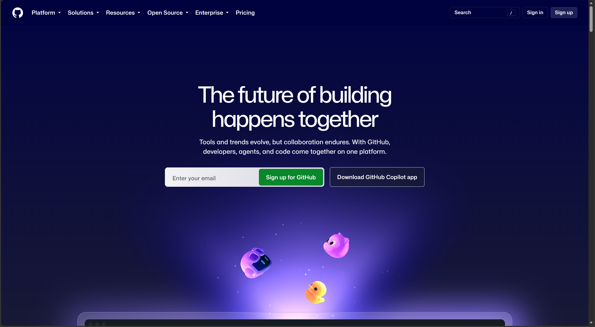

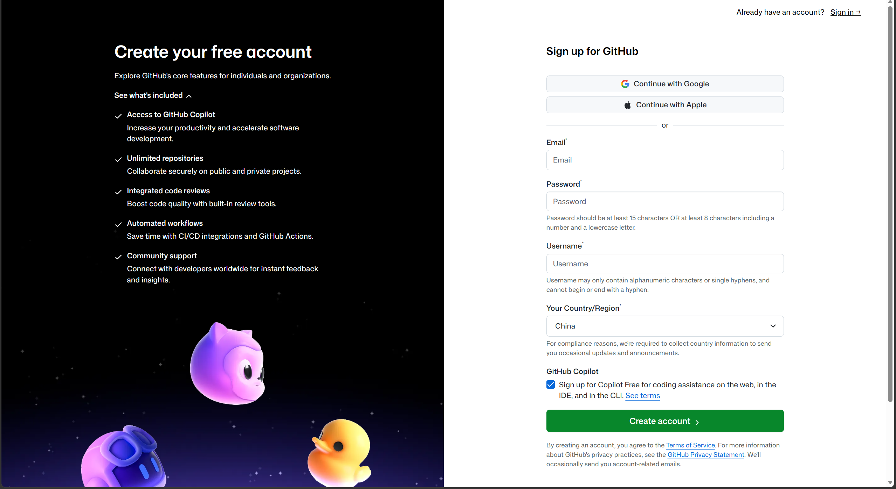

### 关于网络访问

GitHub 需要正常联网。如果页面打不开或加载很慢，请先检查网络连接。必要时，请在遵守所在地法律法规、学校规定和网络安全要求的前提下，使用合规方式科学上网。本教程不讲具体配置，也不要安装来路不明的软件，或向他人提供账号、验证码和密钥。

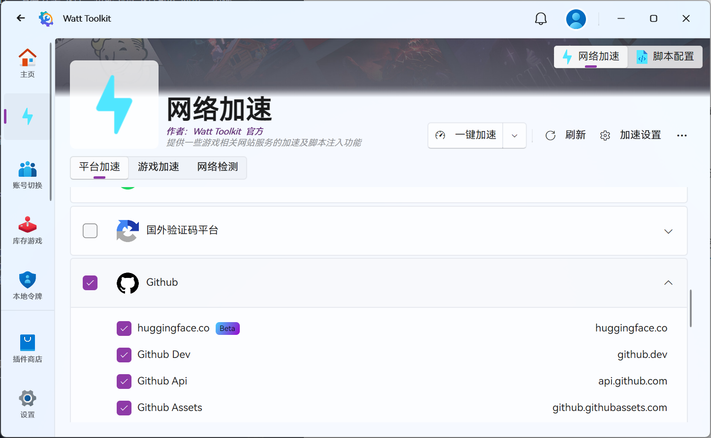

## 3. 认识 GitHub 页面

登录后，先记住以下位置：

- **Profile**：个人主页，可以查看自己公开的仓库和活动。
- **Repositories**：仓库列表，一个仓库通常对应一个项目。
- **Code**：项目文件与源码。
- **Issues**：问题、需求和讨论记录。
- **Pull requests**：合并代码的申请与审查页面。
- **Actions**：自动构建、测试或部署记录。
- **Settings**：仓库设置，删除仓库等危险操作也在这里。

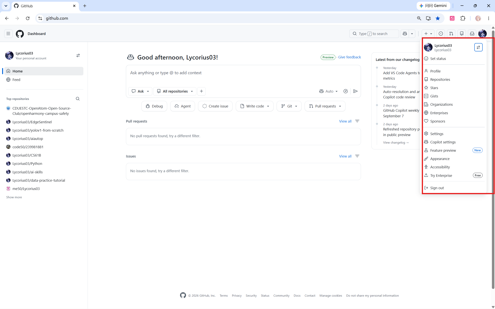

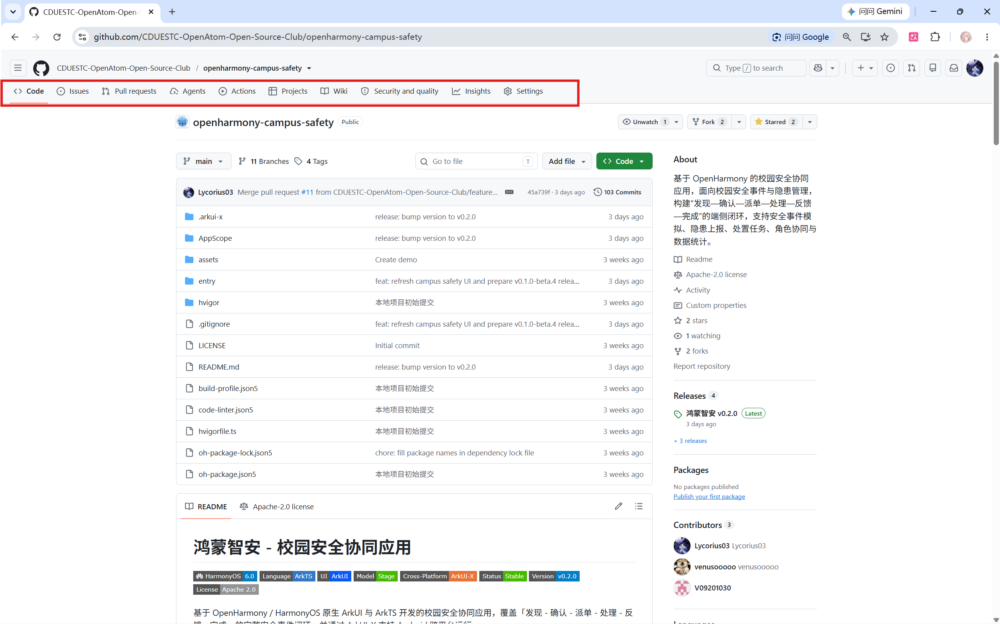

## 4. 安装 Git

在 Windows 上打开 [Git 官方下载页](https://git-scm.com/download/win)，下载安装程序。初学者通常可以保留默认选项。安装完成后，重新打开 VS Code。

在 VS Code 中选择“终端 → 新建终端”，输入：

```powershell
git --version
```

如果显示类似 `git version 2.x.x`，说明安装成功。如果提示找不到 `git`，先完全退出并重新打开 VS Code；仍然失败时再检查 Git 是否安装成功以及是否加入了系统 PATH。

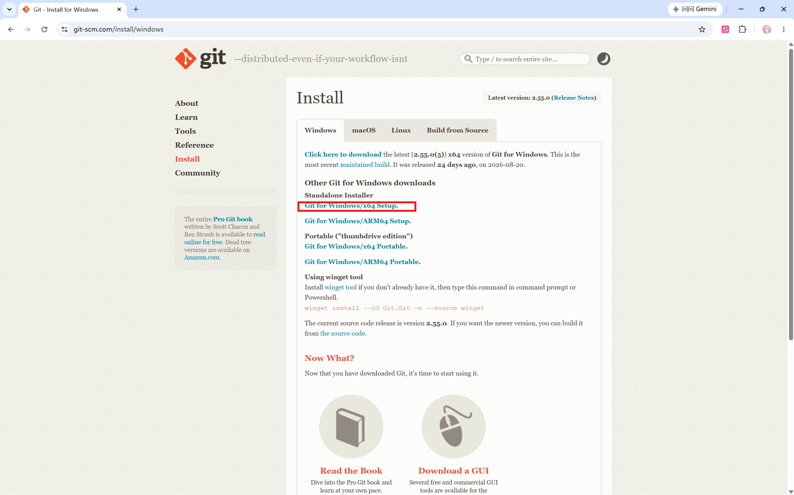

## 5. 第一次配置 Git

下面两项信息会写入每次提交记录。请替换成自己的 GitHub 用户名和邮箱：

```powershell
git config --global user.name "your-name"
git config --global user.email "your-email@example.com"
```

检查配置：

```powershell
git config --global --list
```

建议使用 GitHub 账号中已经验证的邮箱。如果不想公开真实邮箱，可以在 GitHub 邮箱设置中使用 GitHub 提供的隐私邮箱。

这些是提交记录中的署名信息，不是登录密码。命令里的英文双引号要保留，替换引号中的内容；`your-name` 之类是待替换示例，不是必须使用的名字。

## 6. 仓库与工作区

一个常见项目包含三层状态：

1. **工作区**：你正在编辑的文件。
2. **暂存区**：准备放进下一次提交的改动。
3. **提交历史**：已经正式记录的版本。

可以把它想成写作业：先修改草稿，用 `git add` 挑选要交的内容，再用 `git commit` 形成一次有说明的存档。

## 7. 六个最常用命令

### 7.1 clone：下载仓库

```powershell
git clone https://github.com/用户名/仓库名.git
```

它会在当前目录创建一个项目文件夹，并下载仓库内容和历史记录。不要在已经有同名文件夹的位置重复执行。

### 7.2 status：查看状态

```powershell
git status
```

这是最值得频繁使用的命令。它只查看状态，不会修改文件。

### 7.3 add：把改动加入暂存区

```powershell
git add README.md
git add .
```

第一条只暂存指定文件；第二条暂存当前目录下的所有改动。执行 `git add .` 前应先用 `git status` 确认没有敏感文件或无关文件。

### 7.4 commit：形成一次本地提交

```powershell
git commit -m "Add project introduction"
```

提交信息应该简短、清楚地说明“这次改了什么”。推荐使用英文，例如：

- `Add home page`
- `Fix incorrect data path`
- `Update setup instructions`

也可以使用清楚的中文，例如 `补充环境安装说明`。不要使用 `update`、`123`、`修改一下` 这类无法说明内容的信息。

### 7.5 push：上传本地提交

```powershell
git push
```

第一次推送新分支时，Git 可能提示使用：

```powershell
git push -u origin 分支名
```

`push` 上传的是已经 `commit` 的记录，没有提交的文件不会被上传。

### 7.6 pull：拉取远程更新

```powershell
git pull
```

开始修改协作项目之前先拉取更新，可以减少冲突。如果本地和远程修改了同一位置，Git 可能要求处理冲突；不要看到冲突就随意删除文件，应先读清楚冲突标记并与合作者确认。

## 8. 从 GitHub 拉取一个项目

### 8.1 先克隆本教程仓库

实验使用的 `webpage-source.txt` 位于本教程的 GitHub 仓库中。它还没有出现在你的电脑上，所以实验的第一步必须是把仓库克隆下来。这里的“克隆”就是 `clone`：它会下载文件，并保留后面练习 `pull` 时需要的 Git 历史。

1. 选择一个专门存放学习材料的父目录，例如 `F:\learning`。路径只是示例，请换成你自己的英文路径。
2. 在 VS Code 选择“终端 → 新建终端”，切换到这个父目录：

   ```powershell
   cd "F:\learning"
   ```

   如果你的目录还不存在，可以先用资源管理器创建它，再执行 `cd`。`cd` 只负责切换当前位置，不会下载文件。
3. 执行下面三行命令。每行按回车，等上一行执行结束后再输入下一行：

   ```powershell
   git clone https://github.com/Lycorius03/data-practice-tutorial.git
   cd data-practice-tutorial
   git status
   ```

   看到 `On branch main` 和 `nothing to commit` 一类提示，说明仓库已经下载并且当前位置正确。第一次执行 `git clone` 可能会打开浏览器完成 GitHub 授权，按提示操作即可，不要把密码写进命令。
4. 用 `dir` 检查网页源代码确实在克隆的仓库里：

   ```powershell
   dir .\01-git-and-github
   ```

   列表中应该能看到 `README.md` 和 `webpage-source.txt`。这个 TXT 才是实验要复制的材料，不能把仓库里的教师预览文件当作自己的作业。
5. 在 VS Code 中选择“文件 → 打开文件夹”，打开当前的 `data-practice-tutorial` 文件夹。也可以在终端尝试 `code .`；如果系统提示找不到 `code` 命令，就使用菜单打开，不影响 Git 操作。

如果终端提示 `destination path ... already exists`，不要再次 clone。先进入已有目录并获取更新：

```powershell
cd "F:\learning\data-practice-tutorial"
git pull
```

之后每次开始学习前，也可以在这个目录执行一次 `git pull`，把老师补充的内容同步下来。

### 8.2 克隆其他 GitHub 仓库

上面是本教程的完整示例。以后遇到其他项目，可以沿用同一套流程：

1. 打开目标仓库的 `Code` 页面。
2. 单击绿色 **Code** 按钮。
3. 选择 HTTPS，复制仓库地址。
4. 在电脑上进入用于存放项目的父目录。
5. 执行 `git clone 仓库地址`。
6. 进入新生成的项目文件夹，再用 VS Code 打开它。

`clone` 会自己新建项目子文件夹，下载前终端应位于用于存放项目的父目录。不要在同一位置反复 clone；先检查第一次是否已经生成了文件夹。

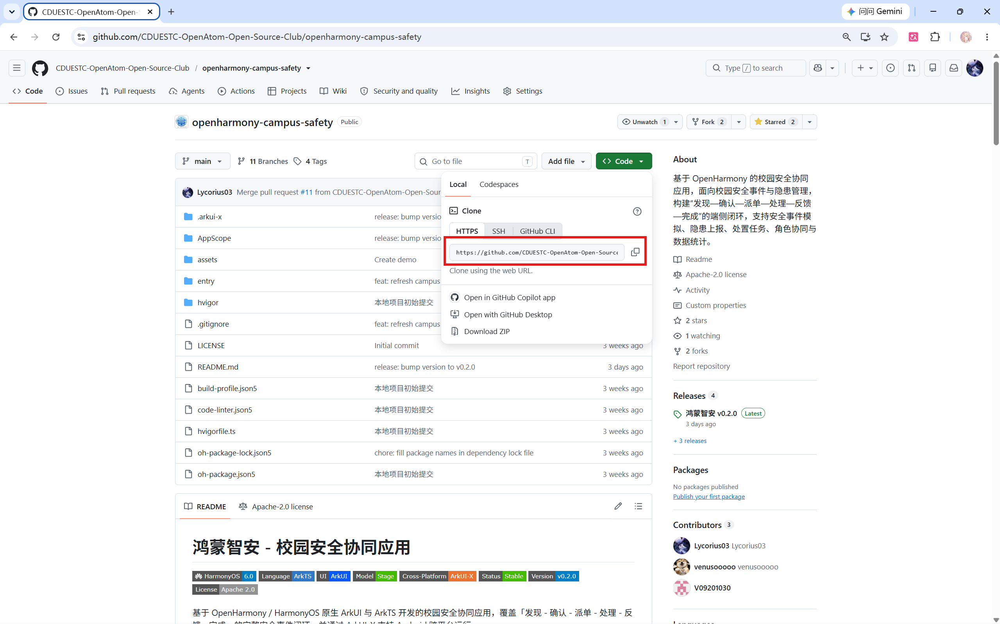

## 9. 一个清楚的日常开发流程

```text
打开项目 → git pull → 新建分支 → 修改文件 → 运行检查
→ git status → git add → git commit → git push → 发起 Pull Request
```

项目文件建议按用途整理，例如：

```text
my-project/
├─ README.md
├─ src/
├─ data/
├─ images/
└─ .gitignore
```

文件名尽量使用有意义的英文或拼音，避免 `新建文件1.py`、`最终版2.py`。项目的使用方式、环境要求和运行方法写入 `README.md`。

## 10. Branch：在独立分支上工作

分支可以让你在不直接影响主分支的情况下修改项目。创建并切换分支：

```powershell
git switch -c add-personal-page
```

查看当前分支：

```powershell
git branch
```

切回主分支：

```powershell
git switch main
```

分支名应说明任务，例如 `fix-login-error`、`add-data-report`。一个分支尽量只完成一个清楚的任务。

## 11. Fork 与 Pull Request

**Fork** 会把别人的仓库复制到你的 GitHub 账号下。你可以在自己的副本中修改，再通过 **Pull Request（PR）** 请求原仓库接收这些修改。

基本流程是：

1. 在原仓库网页右上角单击 **Fork**。
2. 确认目标账号和仓库名称，创建 Fork。
3. Clone 自己账号下的仓库。
4. 建立新分支并完成修改。
5. Commit 并 Push。
6. 回到 GitHub，单击 **Compare & pull request**。
7. 检查源分支、目标分支、标题和说明。
8. 创建 PR，等待维护者审查。
9. 根据反馈继续修改并推送到同一分支，PR 会自动更新。

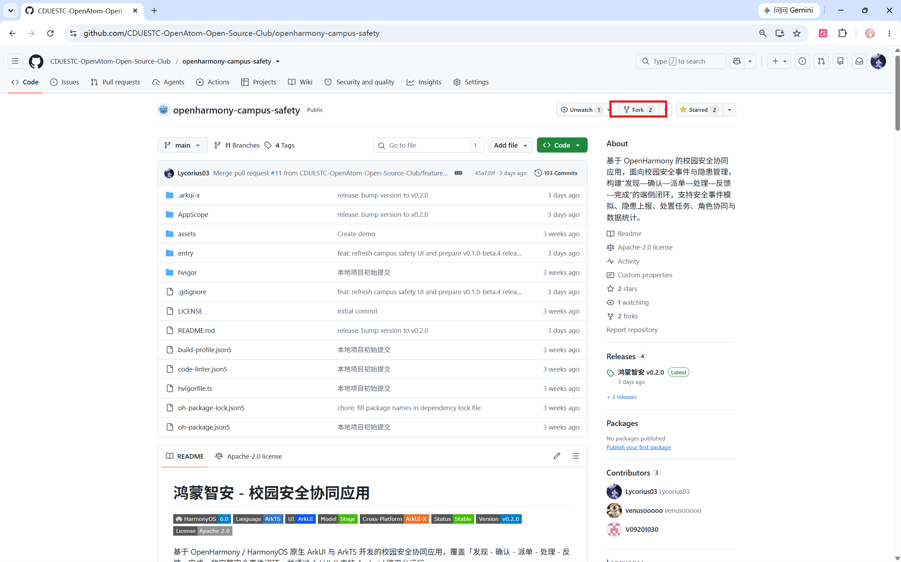

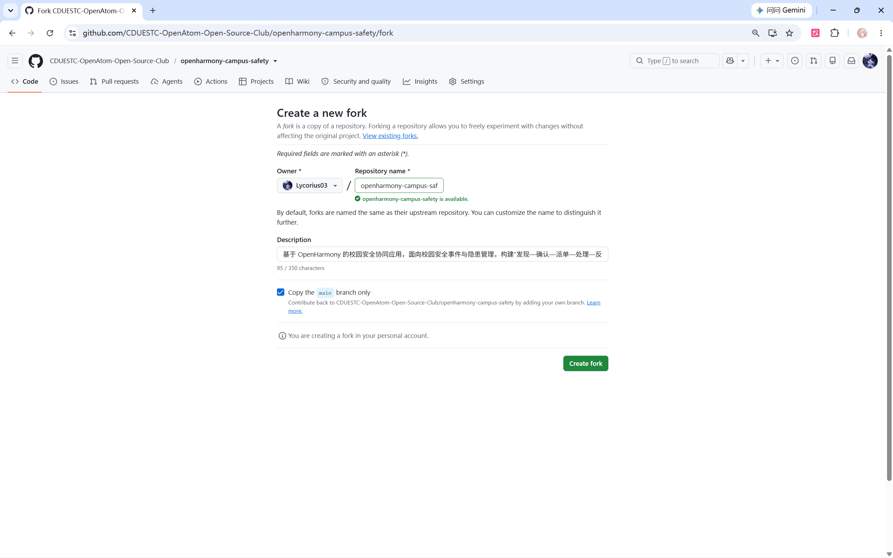

PR 描述至少写清楚：完成了什么、为什么要改、如何检查结果。不要只写“完成了”。

## 12. `.gitignore` 与敏感信息

`.gitignore` 用于告诉 Git 哪些文件不应加入版本管理。Python 项目可以从下面的基础内容开始：

```gitignore
# Python cache
__pycache__/
*.py[cod]

# Virtual environments
.venv/
venv/

# Local environment and secrets
.env
*.key
*.pem

# Editor and operating system files
.vscode/
.DS_Store
Thumbs.db

# Temporary outputs
*.log
tmp/
```

绝对不要公开上传：API Key、Token、私钥、应用签名文件、账号密码、包含个人隐私的数据、本地 `.env` 配置。虚拟环境、缓存、临时文件和无用日志虽然未必是秘密，也不应提交。

重要：`.gitignore` 只能阻止“尚未被 Git 跟踪”的文件。如果秘密已经提交，后来再写进 `.gitignore` 并不能从历史中删除它。此时应立即让对应密钥失效并重新生成，再寻求老师或项目维护者帮助清理历史。

提交前执行：

```powershell
git status
git diff --staged
```

认真阅读将要提交的文件和内容。

## 13. 实验一：创建、推送并部署个人网页

### 实验背景

你将制作一个名为“未定义”的个人数字空间：拖动三维粒子作品、轻点打散、调节形态和配色，展开一段送给此刻自己的回应，再写下宣言并保存成图片。最后使用 GitHub Pages 为它生成一个别人也能打开的链接。

本章先体验“亲手把代码变成作品”。网页外观由 CSS 控制，按钮反应由 JavaScript 实现，它们已经和 HTML 一起装在单个文件中。现在只需要理解文件操作和几处个性化修改，不要求掌握完整前端开发知识。

### 实验目标

- 会在网页端创建仓库。
- 会从 TXT 复制完整代码，创建、保存和打开 HTML 文件。
- 会修改源文件，并通过刷新浏览器确认变化。
- 会在 VS Code 中打开项目并使用 Git 命令。
- 会完成 `add → commit → push`。
- 会通过网页设置 GitHub Pages。

### 准备工作

- 已安装 Git 和 VS Code。
- 已登录并验证 GitHub 账号。
- 已完成第 0 节的文件操作练习，创建了自己的 `my-first-page` 项目目录。
- 已按第 8.1 节将 `data-practice-tutorial` 克隆到电脑。若尚未克隆，先完成“操作步骤”中的“开始前：克隆教程仓库”。

### 本章提供的材料

你在实验开始时只需要使用 [webpage-source.txt](webpage-source.txt)。它包含完整的 HTML 源码，里面没有需要删除的说明文字或 Markdown 围栏。这个文件来自你刚刚克隆的 `data-practice-tutorial/01-git-and-github/` 目录。

面向学生的实验材料不提前提供或链接可直接打开的 `index.html`。你需要在第 0 节创建的 `code-practice/my-first-page/` 中亲手创建它，再把 TXT 的全部内容粘贴进去。保存并用浏览器打开后，才会第一次看到完整网页。这正是本实验要练习的过程。请不要在 `data-practice-tutorial` 克隆目录中直接创建作业文件，否则容易把作业误提交到教程仓库。

开始复制前，两个目录的关系应该类似下面这样。左边是只读的课程材料，右边是你要修改和提交的作业：

```text
learning/
├─ data-practice-tutorial/
│  └─ 01-git-and-github/
│     └─ webpage-source.txt
└─ code-practice/
   └─ my-first-page/
```

复制并保存后，项目才会变成：

```text
code-practice/
└─ my-first-page/
   └─ index.html
```

### 操作步骤

#### 开始前：克隆教程仓库

如果已经按第 8.1 节完成并且能在 `data-practice-tutorial/01-git-and-github/` 中看到 `webpage-source.txt`，可以跳到下一小节。否则，在 VS Code 的 PowerShell 终端中执行下面的命令。示例中的 `F:\learning` 需要替换为你自己的父目录：

```powershell
cd "F:\learning"
git clone https://github.com/Lycorius03/data-practice-tutorial.git
cd data-practice-tutorial
git status
dir .\01-git-and-github
```

`git clone` 只需要执行一次。看到 `README.md` 和 `webpage-source.txt`，并且 `git status` 显示当前在 `main` 分支，就可以继续。若提示目标文件夹已经存在，不要再次 clone，进入已有目录后执行 `git pull` 即可。确认源代码位置后，再打开第 0 节创建的 `code-practice/my-first-page` 文件夹作为作业目录。

#### A. 从 TXT 创建自己的网页

1. 在 VS Code 打开自己的 `my-first-page` 文件夹。确认左侧最上方显示正确的项目名。
2. 通过“文件 → 打开文件”打开教程提供的 `webpage-source.txt`。点击代码编辑区，再按 `Ctrl+A`、`Ctrl+C` 复制全部内容。打开 TXT 不需要重新切换项目文件夹。
3. 在左侧项目名旁点击“新建文件”，输入 `index.html` 并回车。
4. 点击新文件编辑区，按 `Ctrl+V` 粘贴，再按 `Ctrl+S` 保存。内容第一行应为 `<!doctype html>`，最后一行为 `</html>`。
5. 看一下 VS Code 右下角的文件类型，应识别为 HTML；编码应为 UTF-8。若中文乱码，先检查编码，不要逐字替换乱码。

6. 右键左侧 `index.html`，选择“在文件资源管理器中显示”，然后双击该文件。如果系统询问使用哪个应用，选择 Edge、Chrome 或其他浏览器。
7. 看到“你，未被定义。可能，正在发生。”和粒子环，就说明网页打开成功。按下面的小任务探索它：

   - 在粒子环上按住鼠标拖动，改变观察角度；松手后会带着短暂惯性继续转动。轻点画布或点击“打散一下”，观看粒子平滑展开再聚合。
   - 移动“秩序 / 自由”滑块，观察形态变化；页面默认使用冰蓝氛围，也可以点击三个色圆切换为青柠、落日或冰蓝。
   - 点击“暂停流动”，确认作品停止自动旋转，但仍可以手动拖动；再点击“继续流动”。“回到最初”会恢复初始角度、形态与配色。
   - 点击不同心情，观察对应区域展开并显示回应。
   - 点击“制作我的宣言卡”，输入昵称和一句宣言，右侧卡片会实时更新。点击“保存宣言卡”，在浏览器下载列表中打开 `我的宣言卡.png`。

   键盘也可以操作：按 `Tab` 移动焦点，粒子画布获得焦点后，用方向键旋转、空格键打散；弹窗内按 `Esc` 关闭。如果系统启用了“减少动态效果”，页面默认暂停流动，并减弱打散动画。手机上可以横向拖动作品，纵向滑动仍用于浏览页面。

浏览器地址栏此时通常以 `file:///` 开头，表示正在查看电脑里的本地文件。这个路径发给同学通常打不开，因为对方没有你电脑上的这个文件。后面发布得到的 `https://...` 才是可分享的网址。

本页不需要安装 Python、Node.js 或网页插件，也不需要先启动服务器。断网时，粒子互动和宣言卡仍可以工作。**浏览器中的昵称、宣言、观察角度和配色选择只在本次页面有效，刷新就会重置，也不会写回 HTML 文件或传给其他人。** 下载的 PNG 是单独保存的图片，刷新网页不会删除它。

浏览器下载完成后，可以按 `Ctrl+J` 查看下载列表，再点击“在文件夹中显示”找到图片。重复下载时，浏览器可能给文件名加上 `(1)` 等后缀；它们是多份独立文件。PNG 记录卡片外观，不能像网页那样点击互动。

#### B. 让网页真正带上你的风格

1. 回到 VS Code 的 `index.html`，按 `Ctrl+F` 搜索“个性化修改 A”。修改它下面标题中的中文，保留两边的标签。例如把“你，未被定义。”改成“我，从这里出发。”。
2. 搜索“个性化修改 B”，把页脚里的“正在学习的我”换成自己的昵称。
3. 按 `Ctrl+S`，切回浏览器，按 `Ctrl+R` 刷新。核对刚才的两处文字真的发生了变化。
4. 可选挑战：搜索 `id="reply-0"`，定位第一项心情的回应，修改标签之间的中文，保留标签与属性。保存后刷新，再点击对应心情验证。源码里的“个性化修改 C”注释也标明了这四处回应的位置。

“在表单里输入昵称”和“在源文件里修改文字”不同：前者只是这次浏览时的临时互动，后者保存后可以随 Git 提交，并成为别人打开网页时看到的默认内容。编辑源码时误删标签或引号，可以先按 `Ctrl+Z` 撤销。

#### C. 创建远程仓库并推送

1. 在 GitHub 首页单击右上角 `+`，选择 **New repository**。
2. 仓库名填写 `my-first-page`，可见性选择 **Public**。公开仓库中的源码可以被别人查看，个性化内容使用昵称即可。
3. 本次练习不要自动创建 README、`.gitignore` 或 License，让远程仓库保持为空，再单击 **Create repository**。

   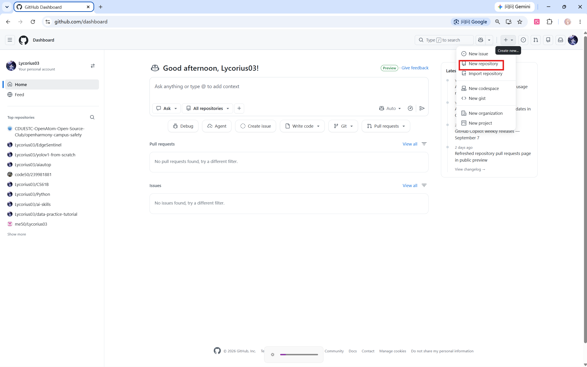

   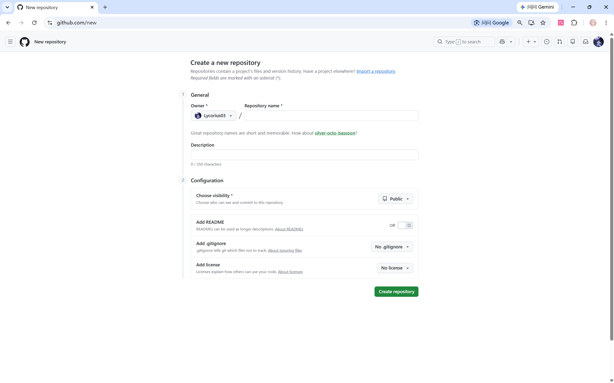

4. 回到 VS Code，新建终端。先用 `pwd` 确认位于自己的 `my-first-page`，用 `dir` 确认这里直接能看到 `index.html`。不要在整套教程的根目录执行 `git init`。
5. 依次执行下面的命令。远程地址中的“你的用户名”必须替换；每行按回车运行，若某行报错，先处理该错误，再继续。

   ```powershell
   git init
   git add index.html
   git commit -m "Create personal home page"
   git branch -M main
   git remote add origin https://github.com/你的用户名/my-first-page.git
   git push -u origin main
   ```

   `git init` 把当前文件夹建立为本地仓库；`git branch -M main` 统一主分支名；`origin` 是远程仓库的常用别名。建立仓库后会有一个通常隐藏的 `.git` 文件夹，里面是版本历史，不要随意删除或编辑。

6. 刷新 GitHub 仓库网页，确认 `index.html` 直接位于仓库根目录。TXT 是供复制的材料，不必上传；也不要把整个 `code-practice` 目录包一层上传。

#### D. 发布并检查网页

1. 打开仓库 **Settings → Pages**。
2. 在 **Build and deployment → Source** 中选择 **Deploy from a branch**，分支选择 `main`，目录选择 `/(root)`，点击 **Save**。
3. 等待部署完成，打开页面给出的 `https://...` 网址。构建状态可在 **Actions** 查看，刚点击保存不等于发布已经完成。
4. 检查个性化标题和署名，再测试粒子拖动与打散、形态滑块、配色、暂停/重置、心情展开，以及宣言卡下载。试着把浏览器窗口缩窄，检查内容能否正常阅读。
5. 把网页链接发给同学，请对方打开。分享的是 Pages 访问链接，而不是仓库源码地址或本地文件路径。

#### E. 用一次小修改练习后续更新

再次修改网页中的一句话，保存并在本地刷新检查。在自己的项目终端执行：

```powershell
git status
git diff
git add index.html
git commit -m "Personalize page message"
git push
```

等待 Pages 更新后刷新公开网页，确认新文字出现。后续修改不需要重新执行 `git init` 或 `git remote add origin`。如果 `git diff` 的长输出进入分页显示，按 `q` 返回终端输入状态。

### 验收标准

- 提交信息能够说明修改内容。
- GitHub Pages 地址可以打开，并显示自己的文字。
- 完成一次追加修改，并在公开网页中看到更新。
- `git status` 显示没有未提交的修改。

### 常见问题

- 页面显示 404：先确认文件名严格为 `index.html`，再等待几分钟并查看 Actions 部署状态。
- 双击后显示源代码或打开了记事本：检查真实扩展名，再右键选择“打开方式 → 浏览器”；编辑文件仍使用 VS Code。
- 修改后网页没变化：先确认编辑的是自己的 `index.html`、已经保存，且浏览器打开的是同一个文件。线上页面还需要 Commit、Push 并等待部署成功。
- 只有文字、没有样式，或者按钮无反应：确认 TXT 从第一行到最后一行完整复制，检查是否误删了 `<style>`、`<script>`、标签或引号。完整源码只应粘贴一遍。
- 提示 `not a git repository`：终端可能不在项目目录，先用 `pwd` 检查；首次初始化应在自己的 `my-first-page` 内完成。
- 推送时要求登录：按照系统提示在浏览器完成 GitHub 授权，不要把密码写进命令。
- 提示远程仓库已有内容：不要盲目强制推送，先检查是否在创建仓库时加入了 README，并向老师确认处理方式。

## 14. 本章检查清单

- [ ] 我会创建文件夹和文件，检查扩展名，保存并重新打开文件。
- [ ] 我能区分编辑器、浏览器和终端，并检查当前路径。
- [ ] 我能区分本地文件地址与公开网址。
- [ ] 我能解释 Git 和 GitHub 的区别。
- [ ] 我会使用 `clone`、`status`、`add`、`commit`、`push`、`pull`。
- [ ] 我知道提交前必须检查改动和敏感信息。
- [ ] 我完成了网页部署实验。
